### Circlick

##### Because "AI" - and humans - both ***suck*** at counting more than ~10 of anything.

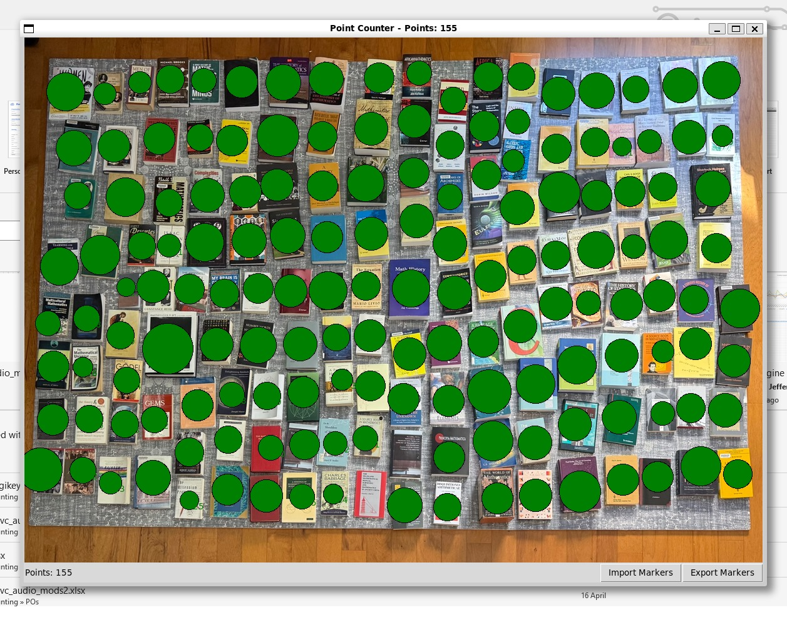

---

#### Whatcha gon' need?

* pillow
* tkinter

---

Making it work (on *my* machine...)

1. Grab this repo.
2. Do the pip thing for pillow

   1. pip install pillow
3. Do a slightly different thingfor tkinter ([https://stackoverflow.com/a/74607246]())

   1. sudo apt-get install python3-tk
4. Run the thing

   1. python3 circlick.py
5. You should now see the GUI for the glorified mouse click counter!

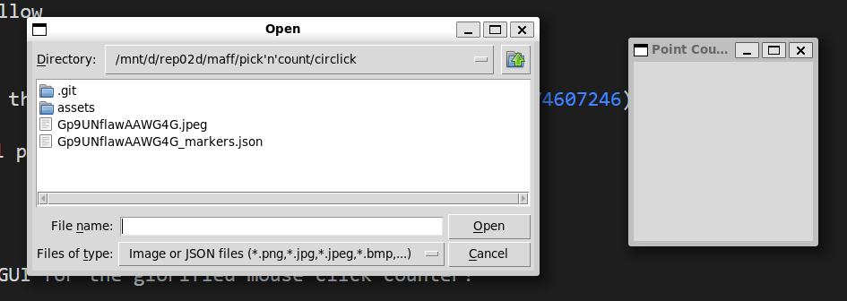

---

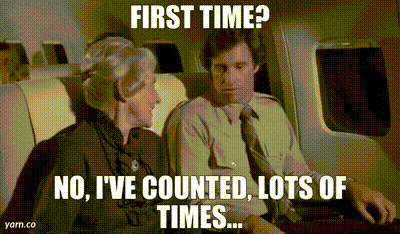

1. Find the image that has the things that need counting.

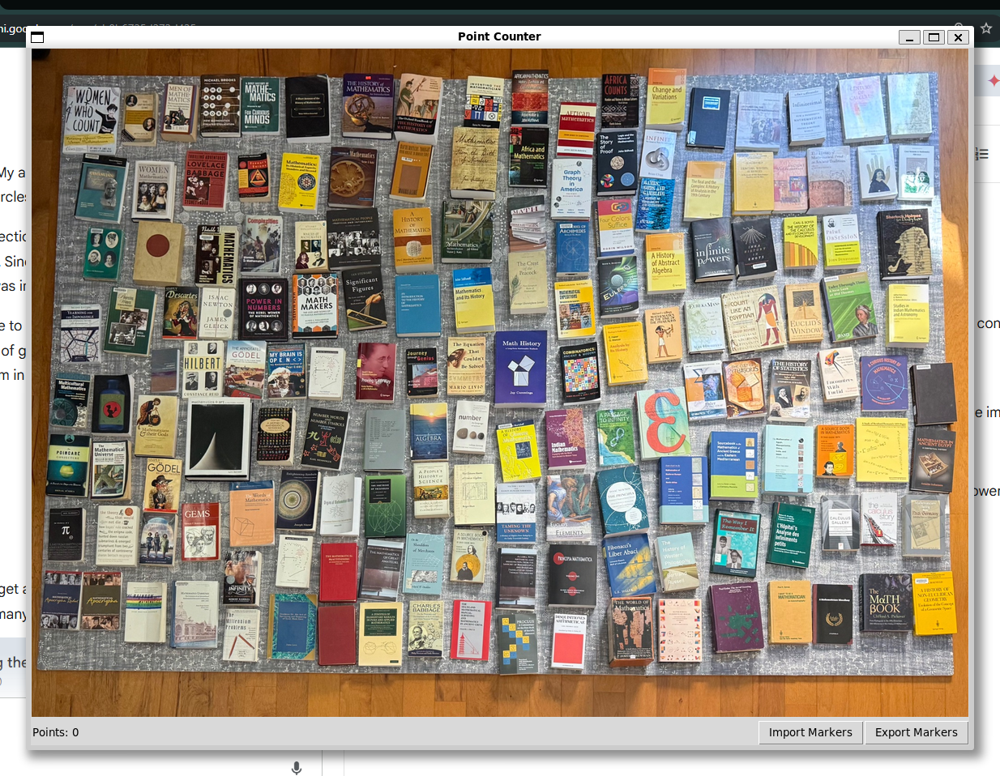

2. Start*Circlick-ing!*™

   1. Click the centre of an object.
   2. While holding the left mouse button, drag the cursor to the desired marker radius.

      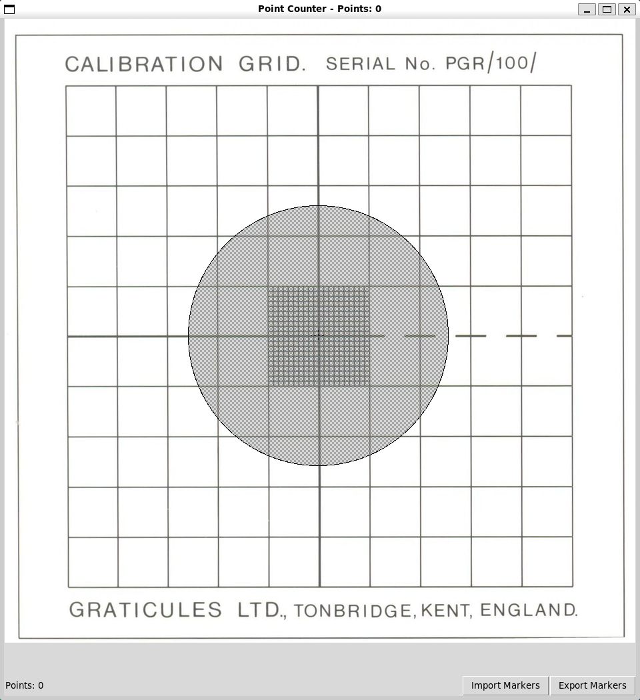
   3. When you release the mouse, you get a shiny new marker!

      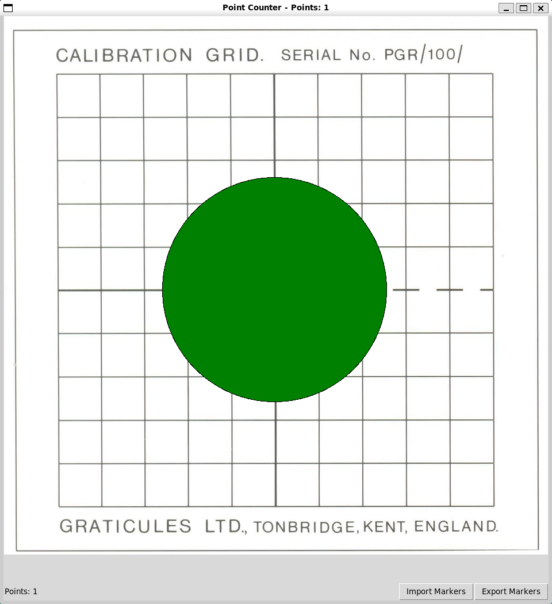
   4. Do that n more times. Really up to you how many.

      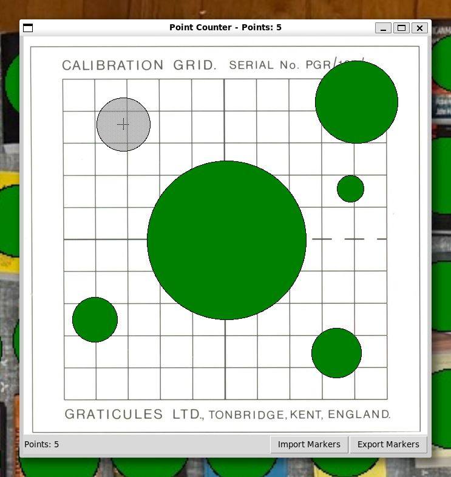
3. Congrats, you have counted things. The total number of things is displayed;

   Here,
   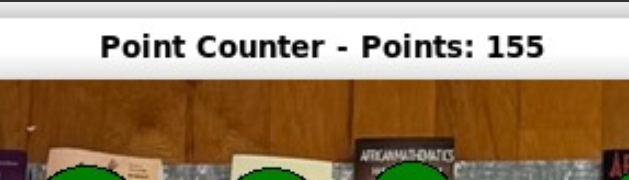

   and also, here;

   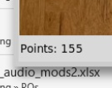

## Other stuff...

### Turf Wars?

If your circlick ends up close enough to another circlick, and insults are exchanged, the existing circlick gets all red and angry, and scares the new one away. *(Marvel, I know what this looks like, don't sue me)

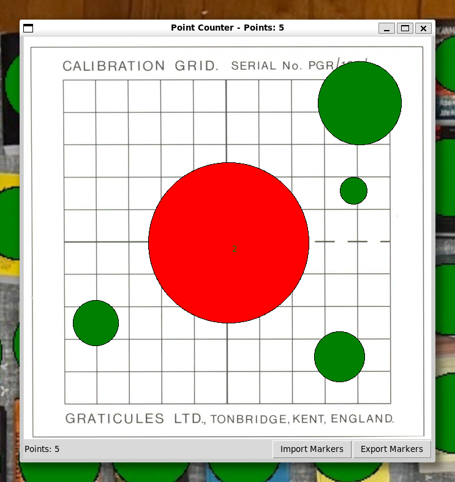

### "Dang it, I got too excited and started counting things I didn't mean to!"

It's ok - it happens to all of us. Don't worry, I did it too - there are at least two ways to get your clicks together. 

1. Hit backspace, and start going back in time. (I should probably add a "redo")
2. A more surgical approach is to
   1. right click on the offending circle - this does two things!
      1. It lets you move a circlick (I know, pretty slick right?)
      2. It kind of unbreaks what should be the default cursor behavior,and allows you to mouse over any of the circlicks.

         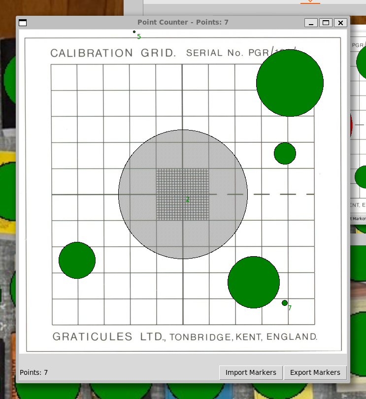
      3. In this mode, you can then press 'd' - to delete the circlick under the mouse cursor.

         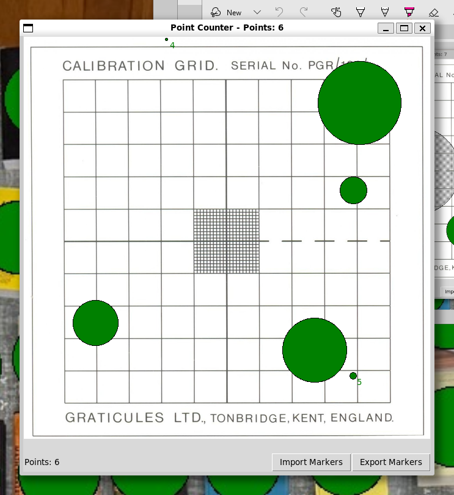

### Looking to impress less technical co-workers?

Easy - just click "Export Markers" for some free JSON. It should end up wherever the image you are counting was found. Check there. 

### Need a break from counting?

Gotcha covered. Eagle eyes will have noticed that the opening file picker selects image files, and of course, JSON. Makes sense now right?

If your boss is telling you do do some real work - you can savepoint with "Export Markers", and later, when they are busy with something else - just open that JSON file, and I am about 99% confident you should be able to pick up at your last circlick
